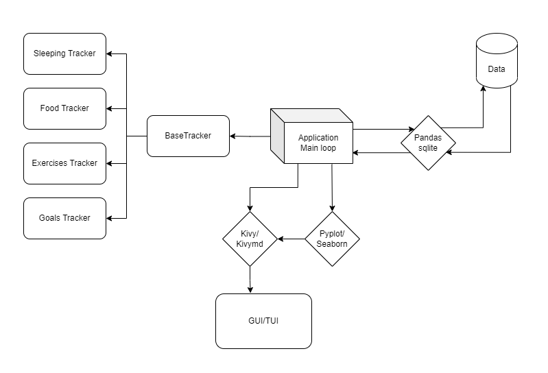

# }{avau by SuccsessContent


Python collaborative project for uneex course

**}{avau** is a mobile application for daily tracking of habbits, moods, exercises, and many more!

## Opportunities
**}{avau** is professional self-imporvement mentor-app. It can track many sides of your life, helping you in becoming the better version of yourself.

* Make reflections of your daily life
* Analyze your habbits
* Analyze your sleeping
* Track the food you eat everyday
* Start and track exercising in your tempo
* Create goals
* Gather and explore your daily/weekly/mothly/year statistics
* Enjoy the pretty graphics
* Export your statisitcs in many extensions

## Architecture

<p align="center">
  
</p>

The application consists of 4 parts:
* Application's main loop. It's the key part, hadnling the main loop and the entire data transfer between other parts.
* Logic part, including BaseTracker and it's derivatives. BaseTracker is the main class of daily custom habbit trackers. The classes SleepingTracker, ..., correspond to narrow tasks of relevant habbit tracking.
* Database handling part, including sqlite database, that stores users daily data. Also pandas library is used to gather statistics from data.
* GUI part, implemented via kivy, kivymd. It gets users prompt (e.g., pressing buttons, inputing texts, ets), and displays different graphics, plotted via pyplot/seaborn.

Also, the application can export data and statistics in wide range of extensions. Implemented via pandas.

## UI
The preliminary UI concept can be found below.

[UI concept](https://www.figma.com/file/FXHWjqIN4tdKqDirSu9XrQ/Untitled?node-id=0%3A1)

## Installation
How to init repository:
```(bash)
pip install -r requirements.txt
pre-commit install
```

## Other
Commit messages style: https://habr.com/ru/post/183646/
